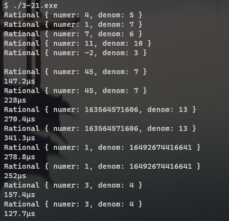
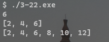

# Chapter 3. Names, Scopes, Bindings

---

## TOC

1. [3-1](#3-1)
2. [3-2](#3-2)
3. [3-3](#3-3)
4. [3-4](#3-4)
5. [3-5](#3-5)
6. [3-6](#3-6)
7. [3-7](#3-7)
8. [3-8](#3-8)
9. [3-9](#3-9)
10. [3-10](#3-10)
11. [3-11](#3-11)
12. [3-12](#3-12)
13. [3-13](#3-13)
14. [3-14](#3-14)
15. [3-15](#3-15)
16. [3-16](#3-16)
17. [3-17](#3-17)
18. [3-18](#3-18)
19. [3-19](#3-19)
20. [3-20](#3-20)
21. [3-21](#3-21)
22. [3-22](#3-22)
23. [3-23](#3-23)
24. [3-24](#3-24)
25. [3-25](#3-25)
26. [3-26](#3-26)
27. [3-27](#3-27)
28. [3-28](#3-28)
29. [3-29](#3-29)
30. [3-30](#3-30)
31. [3-31](#3-31)


## [3-1](#TOC)
 
### Q

Indicate the binding time (when the language is designed, when the program is linked, when the program begins execution, etc.) for each of the following decisions in your favorite programming language and implementation. 
Explain any answers you think are open to interpretation.

- The number of built-in functions (math, type queries, etc.)
- The variable declaration that corresponds to a particular variable reference (use)
- The maximum length allowed for a constant (literal) character string
- The referencing environment for a subroutine that is passed as a parameter
- The address of a particular library routine
- The total amount of space occupied by program code and data


### A

My favorite programming language is Rust.


> The number of built-in functions (math, type queries, etc.)

Language design time.

> The variable declaration that corresponds to a particular variable reference (use)

Program writing time.

> The maximum length allowed for a constant (literal) character string

Rust takes constant(literal) character string as a String slice(&str), and that is reference to program data's string bynary.
And it has max limit: `isize::MAX as usize` -> this is binded at language implementation time.

> The referencing environment for a subroutine that is passed as a parameter

Runtime.

> The address of a particular library routine

Link time.

> The total amount of space occupied by program code and data

Load time.


---


## [3-2](#TOC)
 
### Q

In Fortran 77, local variables were typically allocated statically.
In Algol and its descendants (e.g., Ada and C), they are typically allocated in the stack.
In Lisp they are typically allocated at least partially in the heap.
What accounts for these differences? Give an example of a program in Ada or C that would not work correctly if local variables were allocated statically.
Give an example of a program in Scheme or Common Lisp that would not work correctly if local variables were allocated on the stack.


### A


---


## [3-3](#TOC)
 
### Q

Give two examples in which it might make sense to delay the binding of an implementation decision, even though sufficient information exists to bind it early.

### A

1. Polymorphism
  - Language implementation can delay method binding to runtime.
  - Polymorphism makes the object can decide what method would be runned in runtime, so this provide a lot of flexibility.

2. Dynamic linking
  - Usually linking(static link) is done in compile time, dynamic linking is done in runtime.
  - Dynamic linking is slower but space-efficient: if same library is used by many process(program file), the program files can save its memory using dynamic linking.

---


## [3-4](#TOC)
 
### Q

Give three concrete examples drawn from programming languages with which you are familiar in which a variable is live but not in scope.


### A

Javascript case.

Actually I want to do this exercise with Rust, but I can't get to the answer easily.
So I think with Javascript.

1. module: names in module is live, but not in scope if current scope is out of the module
2. shadowing: names which is shadowed is live, but inner scope same name make it out of scope.
3. object which reference count is 0: before garbage collection, the object which RC = 0 is live but not in scope.


---

## [3-5](#TOC)
 
### Q

Consider the following pseudocode:
```
1. procedure main()
2.     a : integer := 1
3.     b : integer := 2

4.     procedure middle()
5.         b : integer := a
6.         procedure inner()
7.             print a, b
8.         a : integer := 3

9.         – – body of middle
10.        inner()
11.        print a, b

12.    – – body of main
13.    middle()
14.    print a, b
```

Suppose this was code for a language with the declaration-order rules of C (but with nested subroutines)—that is, names must be declared before use, and the scope of a name extends from its declaration through the end of the block.
At each print statement, indicate which declarations of a and b are in the referencing environment. What does the program print (or will the compiler identify static semantic errors)?
Repeat the exercise for the declaration-order rules of C# (names must be declared before use, but the scope of a name is the entire block in which it is declared) and of Modula-3 (names can be declared in any order, and their scope is the entire block in which they are declared).


### A

In C:
```
1 1   // from inner(), 7th line
3 1   // from middle(), 11th line
1 2   // from main(), 14th line
```
In C#
```
5th line -> semantic error, use before declaration 
// 8th line a varialbe has scope of entire in middle()
```

In Modula-3
```
3 3   // from inner(), 7th line
3 3   // from middle(), 11th line
1 2   // from main(), 14th line
```

---


## [3-6](#TOC)
 
### Q

Consider the following pseudocode, assuming nested subroutines and static scope:

```
1. procedure main()
2.     g : integer

3.     procedure B(a : integer)
4.         x : integer

5.         procedure A(n : integer)
6.             g := n

7.         procedure R(m : integer)
8.             write_integer(x)
9.             x /:= 2       // –– integer division
10.            if x > 1
11.                R(m + 1)
12.            else
13.                A(m)

14.        // –– body of B
15.        x := a × a
16.        R(1)

17.    // –– body of main
18.    B(3)
19.    write_integer(g)
```

##### a. What does this program print?
##### b. Show the frames on the stack when `A` has just been called. For each frame, show the static and dynamic links.
##### c.  Explain how `A` finds `g`.

### A

##### a.answer
```
9   // 8th line
4   // 8th line
2   // 8th line
3   // 19th line
```

##### b.answer

Stack Frame's dynamic link is the reference to caller's frame and static link is the reference to lexically outer and closest scope's most recent frame.


1. Dynamic link of stack frame.
> Bookkeeping information typically includes the subroutine’s return
address, a reference to the stack frame of the caller (also called the dynamic link), ... -- book 120P

2. Static link of stack frame.
> The simplest way in which to find the frames of surrounding scopes is to maintain a static link in each frame that points to the "parent" frame: the frame of the most recent invocation of the lexically surrounding subroutine. -- book 129~130P

|stack|dynamic-link|static-link|
|-------------|:-----------:|:-----------:|
|stack 5: A(3)|R(3): stack 4|B(3): stack 1|
|stack 4: R(3)|R(2): stack 3|B(3): stack 1|
|stack 3: R(2)|R(1): stack 2|B(3): stack 1|
|stack 2: R(1)|B(3): stack 1|B(3): stack 1|
|stack 1: B(3)|main: stack 0|main: stack 0|
|stack 0: main|-------------|-------------|


##### c.answer

When `A` is called, first find `g` from `A`'s scope, but it cannot find.
So, `A` find `g` from outer scope, so it starts searching from outer closest lexical scope.
Follow to `A`'s static link, and it goes to `B: stack 1`.
Then it finds `g` in `B: stack 1`'s scope, but it isn't in there..
So go to `B: stack 1`'s static link and go to `main: stack 0`.
Then it finds `g` in `main: stack 0`'s scope, then it finds `g`.


---


## [3-7](#TOC)
 
### Q

As part of the development team at MumbleTech.com, Janet has written a list manipulation library for C that contains, among other things, the code in Figure 3.16.

```C
typedef struct list_node
{
    void *data;
    struct list_node *next;
} list_node;

list_node *insert(void *d, list_node *L)
{
    list_node *t = (list_node *)malloc(sizeof(list_node));
    t->data = d;
    t->next = L;
    return t;
}

list_node *reverse(list_node *L)
{
    list_node *rtn = 0;
    while (L)
    {
        rtn = insert(L->data, rtn);
        L = L->next;
    }
    return rtn;
}

void delete_list(list_node *L)
{
    while (L)
    {
        list_node *t = L;
        L = L->next;
        free(t->data);
        free(t);
    }
}
```

##### (a)

Accustomed to Java, new team member Brad includes the following code in the main loop of his program:

```C
list_node* L = 0;
while (more_widgets()) {
    L = insert(next_widget(), L);
}
L = reverse(L);
```
Sadly, after running for a while, Brad’s program always runs out of memory and crashes. 
Explain what’s going wrong.


##### (b)

After Janet patiently explains the problem to him, Brad gives it another try:
```C
list_node* L = 0;
while (more_widgets()) {
  L = insert(next_widget(), L);
}
list_node* T = reverse(L);
delete_list(L);
L = T;
```
This seems to solve the insufficient memory problem, but where the program used to produce correct results (before running out of memory), now its output is strangely corrupted, and Brad goes back to Janet for advice. 
What will she tell him this time?


### A

##### (a)

The data in heap which name `L` points is not released after `reverse()` call.
So loop of above codes would make heap memory full with not using data.

##### (b)

In `reverse()`, the reversed list nodes' data is actually points to the nodes' data before reversed.
`delete_list()` call release the original list nodes' data, so reversed list node's data field, which is pointer to original nodes' data, is released.
That's because the data is strangely corrupted.


---


## [3-8](#TOC)
 
### Q

Rewrite Figures 3.6 and 3.7 in C. 
You will need to use separate compilation for name hiding.

```cpp
// Figure 3.6
#include <time.h>

namespace rand_mod {
    unsigned int seed = time(0); // initialize from current time of day
    const unsigned int a = 48271;
    const unsigned int m = 0x7fffffff;

    void set_seed(unsigned int s) {
        seed = s;
    }

    unsigned int rand_int() {
        return seed = (a * seed) % m;
    }
}
```

```cpp
// Figure 3.7
#include <time.h>

namespace rand_mgr {
    const unsigned int a = 48271;
    const unsigned int m = 0x7fffffff;

    typedef struct {
        unsigned int seed;
    } generator;

    generator* create() {
        generator* g = new generator;
        g->seed = time(0);
        return g;
    }

    void set_seed(generator* g, unsigned int s) {
        g->seed = s;
    }

    unsigned int rand_int(generator* g) {
        return g->seed = (a * g->seed) % m;
    }
}
```


### A

`3-8.rand_mod.c` and `3-8.rand_mgr.c` file.


---


## [3-9](#TOC)
 
### Q

Consider the following fragment of code in C:
```
{ int a, b, c;
    ...

    { int d, e;
        ...

        { int f;
            ...

        }
        ...
    }
    ...

    { int g, h, i;
        ...

    }
    ...
}
```

##### (a)

Assume that each integer variable occupies four bytes.
How much total space is required for the variables in this code?


##### (b)

Describe an algorithm that a compiler could use to assign stack frame offsets to the variables of arbitrary nested blocks, in a way that minimizes the total space required.


### A


##### (a)

Maximum number of variables which can exist at the same time is 6, so 6 * 4 = 24 bytes.

##### (b)

Below is pseudocode.
var_offset_map saves the variable's stack frame offset.

```
variable_stack;
var_offset_map;
block_open {
  open_offset;
  prev;
}

/* save recent opened block's start offset and
 * prev opened block's block_open instance. */
recent_open = block_open(offset_start, null);
current_offset = offset_start;

while (is_next_token()) {
  next_token = get_next_token();

  /* if meet block-opening, update recent_open */
  if (is_block_opening(next_token))
    recent_open = block_open(current_offset, recent_open);

  /* if meet block-closing, pop all variables in that block(lexical scope) */
  else if (is_block_closing(next_token)) {
    while(current_offset > recent_open.open_offset) {
      current_offset -= sizeof(typeof(variable_stack.top()));
      variable_stack.pop();
    }
    recent_open = recent_open.prev;
  }

  /* if meet variable, update current_offset and push to stack */
  else if (is_variable(next_token)) {
    // save variable's offset
    var_offset_map.insert({next_token, current_offset});

    // update stack and current_offset
    variable_stack.push(next_token);
    current_offset += sizeof(typeof(next_token));
  }
}

```


---


## [3-10](#TOC)
 
### Q

Consider the design of a Fortran 77 compiler that uses static allocation for the local variables of subroutines. 
Expanding on the solution to the previous question, describe an algorithm to minimize the total space required for these variables.
You may find it helpful to construct a `call graph` data structure in which each node represents a subroutine, and each directed arc indicates that the subroutine at the tail may sometimes call the subroutine at the head.


### A

1. First scan all code and get all location of subroutine definition.

2. Make N call graph nodes which N is number of all subroutine definitions.

3. Looking around all subroutine's definition, if the subroutine calls other subroutine, make directed arc from caller to callee in call graph.

4. Start traverse from call graph's start call(maybe main procedure), do bfs(or dfs) the graph.

5. If a call graph node visited, static allocation of local variables in coresponding subroutine's definition, and saves the offset.


---


## [3-11](#TOC)
 
### Q

Consider the following pseudocode:
```
1. procedure P(A, B : real)
2.     X : real
 
3.     procedure Q(B, C : real)
4.         Y : real
5.         ...
 
6.     procedure R(A, C : real)
7.         Z : real
8.         ...           –– (*)
 
9.     ...
```

Assuming static scope, what is the referencing environment at the location marked by (*)?


### A
```
B : real // in 1st line
X : real // in 2nd line
A : real // ┬ in 6th line
C : real // ┘
Z : real // in 7th line
```

---


## [3-12](#TOC)
 
### Q

Write a simple program in Scheme that displays three different behaviors, depending on whether we use `let`, `let*`, or `letrec` to declare a given set of names.
(Hint: To make good use of `letrec`, you will probably want your names to be functions [lambda expressions].)


### A

```Scheme
(let ((x 2) (y 3))
  (let ((x 7) (z (+ x y)))
    (* z x)))
; 35

(let* ((x 2) (y 3))
  (let* ((x 7) (z (+ x y)))
    (* z x)))
; 70

(letrec ((x 2)
         (y 3))
  (letrec ((x 7) (z (+ x y)))
    (* z x)))
; error
;   x: undefined;
;   cannot use before initialization
```

> [Reference](https://www.cs.cmu.edu/Groups/AI/html/r4rs/r4rs_6.html#SEC35)


---


## [3-13](#TOC)
 
### Q

Consider the following program in Scheme:

```Scheme
(define A
  (lambda()
    (let* ((x 2)
           (C (lambda (P)
                (let ((x 4))
                  (P))))
           (D (lambda ()
                x))
           (B (lambda ()
                (let ((x 3))
                  (C D)))))
      (B))))
```

What does this program print?
What would it print if Scheme used dynamic scoping and shallow binding?
Dynamic scoping and deep binding? 
Explain your answers.


### A

1. Scheme is lexical(static) scope and deep binding: code prints `2`.

2. Dynamic scoping and shallow binding : code prints `3`.

3. Dynamic scoping and deep binding : code prints `2`.

---


## [3-14](#TOC)
 
### Q

Consider the following pseudocode:

```
1.  x : integer –– global

2.  procedure set_x(n : integer)
3.      x := n

4.  procedure print_x()
5.      write_integer(x)

6.  procedure first()
7.      set_x(1)
8.      print_x()

9.  procedure second()
10.     x : integer
11.     set_x(2)
12.     print_x()

13. set_x(0)
14. first()
15. print_x()
16. second()
17. print_x()
```
What does this program print if the language uses static scoping? 
What does it print with dynamic scoping?
Why?


### A

1. Static scoping
```
1   // 8th line
1   // 15th line
2   // 12th line
2   // 17th line
```


2. Dynamic scoping
```
1   // 8th line
1   // 15th line
2   // 12th line
1   // 17th line
```
At 16th line, after end of `second()` call, the local `x` is deleted.
So 17th line `print_x()` call use most recent used, and alive in current execution `x`.

---


## [3-15](#TOC)
 
### Q

The principal argument in favor of dynamic scoping is that it facilitates the customization of subroutines. 
Suppose, for example, that we have a library routine `print_integer` that is capable of printing its argument in any of several bases (decimal, binary, hexadecimal, etc.). 
Suppose further that we want the routine to use decimal notation most of the time, and to use other bases only in a few special cases: we do not want to have to specify a base explicitly on each individual call. 
We can achieve this result with dynamic scoping by having `print_integer` obtain its base from a nonlocal variable `print_base`. 
We can establish the default behavior by declaring a variable `print_base` and setting its value to 10 in a scope encountered early in execution. 
Then, any time we want to change the base temporarily, we can write

```
begin –– nested block
    print base : integer := 16    –– use hexadecimal
    print integer(n)
```

The problem with this argument is that there are usually other ways to achieve the same effect, without dynamic scoping.
Describe at least two for the `print_integer` example.


### A

1. make two different base function, and use multiple definition.
```
print_integer(n);
print_integer_base(n, 16);
print_integer(n, 16);
```
This way can be implemented easily by overriding, polymorphism, etc.

2. use nonlocal variable `print_base`, but after `print_integer()` call, restore `print_base`;
```
begin     -- nested block
    print_base_save : integer := print_base
    print_base := 16      -- use hexadecimal
    print_integer(n)
    print_base := print_base_save
```
This way is dangerous: programmer may forget to restore the value.


---


## [3-16](#TOC)
 
### Q

As noted in Section 3.6.3, C# has unusually sophisticated support for first-class subroutines.
Among other things, it allows delegates to be instantiated from anonymous nested methods, and gives local variables and parameters unlimited extent when they may be needed by such a delegate. 
Consider the implications of these features in the following C# program:


```c-sharp
1.  using System;
2.  
3.  public delegate int UnaryOp(int n);
4.      // type declaration: UnaryOp is a function from ints to ints
5.  
6.  public class Foo {
7.      static int a = 2;
8.      static UnaryOp b(int c) {
9.          int d = a + c;
10.         Console.WriteLine(d);
11.         return delegate(int n) { return c + n; };
12.     }
13.     public static void Main(string[] args) {
14.         Console.WriteLine(b(3)(4));
15.     }
16. }
```
What does this program print? Which of a, b, c, and d, if any, is likely to be statically allocated? 
Which could be allocated on the stack? 
Which would need to be allocated in the heap?
Explain.


### A

```
5   // 10th line
7   // 14th line
```

1. `a`
    + `a` is statically allocated.
    + It is declared using `static` keyword.
2. b 
    + `b` is statically allocated.
    + It is just a ordinary function.
3. c
    + `c` is heap allocated.
    + It is argument of function `b`, but it is used in the closure which `b` returns.
    + And in closure, the `c` is free variable, so `c` is in closure and heap allocated.
4. d
    + `d` is stack allocated.
    + It is just a local variable in function `b` and it is not used after `b` returned.

[Reference](https://stackoverflow.com/questions/271440/captured-variable-in-a-loop-in-c-sharp/271447#271447)


---


## [3-17](#TOC)
 
### Q

If you are familiar with structured exception handling, as provided in Ada, C++, Java, C#, ML, Python, or Ruby, consider how this mechanism relates to the issue of scoping. 
Conventionally, a `raise` or `throw` statement is thought of as referring to an exception, which it passes as a parameter to a handler-finding library routine. 
In each of the languages mentioned, the exception itself must be declared in some surrounding scope, and is subject to the usual static scope rules. 
Describe an alternative point of view, in which the `raise` or `throw` is actually a reference to a handler, to which it transfers control directly. 
Assuming this point of view, what are the scope rules for handlers? 
Are these rules consistent with the rest of the language?
Explain. 
(For further information on exceptions, see Section 9.4.)


### A


---


## [3-18](#TOC)
 
### Q

Consider the following pseudocode:
```
1.  x : integer –– global

2.  procedure set_x(n : integer)
3.      x := n

4.  procedure print_x()
5.      wirte_integer(x)

6.  procedure foo(S, P : function; n : integer)
7.      x : integer := 5
8.      if n in {1, 3}
9.          set_x(n)
10.     else
11.         S(n)
12.     if n in {1, 2}
13.         print_x()
14.     else
15.         P

16. set_x(0); foo(set_x, print_x, 1); print_x()
17. set_x(0); foo(set_x, print_x, 2); print_x()
18. set_x(0); foo(set_x, print_x, 3); print_x()
19. set_x(0); foo(set_x, print_x, 4); print_x()
```
Assume that the language uses dynamic scoping.
What does the program print if the language uses shallow binding?
What does it print with deep binding? 
Why?

### A

1. shallow binding
```
1 0   //
2 0   //
3 0   //
4 0   //
```

2. deep binding
```
1 0   //
5 2   //
0 0   //
4 4   //
```


---


## [3-19](#TOC)
 
### Q

Consider the following pseudocode:
```
1.  x : integer := 1
2.  y : integer := 2

3.  procedure add()
4.      x := x + y

5.  procedure second(P : procedure)
6.      x : integer := 2
7.      P()

8.  procedure first
9.      y : integer := 3
10.     second(add)

11. first()
12. write_integer(x)
```

##### (a)

What does this program print if the language uses static scoping?

##### (b)

What does it print if the language uses dynamic scoping with deep binding?

##### (c)

What does it print if the language uses dynamic scoping with shallow binding?


### A

##### (a) : `3`

##### (b) : `4`

##### (c) : `1`


---


## [3-20](#TOC)
 
### Q

Consider mathematical operations in a language like C++, which supports both overloading and coercion.
In many cases, it may make sense to provide multiple, overloaded versions of a function, one for each numeric type or combination of types. 
In other cases, we might use a single version — probably defined for double-precision floating point arguments—and rely on coercion to allow that function to be used for other numeric types (e.g., integers). 
Give an example in which overloading is clearly the preferable approach. 
Give another in which coercion is almost certainly better.


### A

1. overloading
```cpp
int min(int x, int y) { ... };            // (1)
float min(float x, float y) { ... };      // (2)
min(2147483647, 2147483646)               // call (1)
min(0.000001, 0.0000002)                  // call (2)
```
First, if 64-bit integer(long long) is type-conversed to double-floating point(64-bit, but it has less significant digit numbers than 64), it has data loss, so overloading is clearly better.
Second, coercion must converse the type of mis-matching type, so it has more overhead.

2. coercion
```cpp
double min(double x, double y) { ... };
min(4.0, 5.0)   // call min(4.0, 5.0)
min(4, 5)       // coercion: 4 -> 4.0, 5 -> 5.0 => call min(4.0, 5.0)
```
If the operation has only no-data-loss type arguments combination, coercion gives flexibility without extra codes: so better.


---

## [3-21](#TOC)
 
### Q

In a language that supports operator overloading, build support for rational numbers. 
Each number should be represented internally as a (numerator, denominator) pair in simplest form, with a positive denominator. 
Your code should support unary negation and the four standard arithmetic operators. 
For extra credit, create a conversion routine that accepts two floating-point parameters - a value and a error bound — and returns the simplest (smallest denominator) rational number within the given error bound of the given value.

### A




---


## [3-22](#TOC)
 
### Q

In an imperative language with lambda expressions (e.g., C#, Ruby, C++, or Java), write the following higher-level functions. 
(A higher-level function, as we shall see in Chapter 11, takes other functions as argument and/or returns a function as a result.)

+ `compose(g, f)` — returns a function `h` such that `h(x) == g(f(x))`.
+ `map(f, L)` — given a function `f` and a list `L` returns a list `M` such that the i-th element of `M` is `f(e)`, where `e` is the i-th element of `L`.
+ `filter(L, P)` — given a list `L` and a predicate (Boolean-returning function) `P`, returns a list containing all and only those elements of `L` for which `P` is true.


### A




---


## [3-23](#TOC)

### Q

Can you write a macro in standard C that "returns" the greatest common divisor of a pair of arguments, without calling a subroutine? 
Why or why not?


### A

I can't...
Because, without calling subroutine, I can't use recursive functions.
So I must use `for`, `while`, `do ... while` statement to make iterative process.
But they are statement: not a expression, so they don't "return" value.
That's because i can't make macro: macro must "return" correct gcd, that means the macro must be evaluated.


---


## [3-24](#TOC)
 
### Q


### A


---


## [3-25](#TOC)
 
### Q


### A


---


## [3-26](#TOC)
 
### Q


### A


---


## [3-27](#TOC)
 
### Q


### A


---


## [3-28](#TOC)
 
### Q


### A


---


## [3-29](#TOC)
 
### Q


### A


---


## [3-30](#TOC)
 
### Q


### A


---


## [3-31](#TOC)
 
### Q


### A


---

# Explorations

