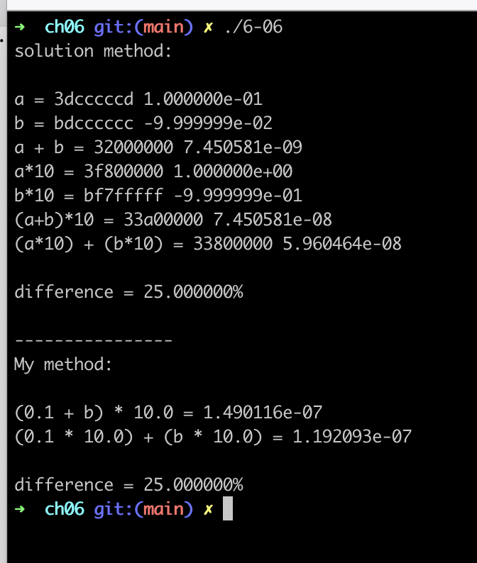

# Chapter 6. Control Flow

---

## TOC

1. [6-1](#6-1)
2. [6-2](#6-2)
3. [6-3](#6-3)
4. [6-4](#6-4)
5. [6-5](#6-5)
6. [6-6](#6-6)
7. [6-7](#6-7)
8. [6-8](#6-8)
9. [6-9](#6-9)
10. [6-10](#6-10)
11. [6-11](#6-11)
12. [6-12](#6-12)
13. [6-13](#6-13)
14. [6-14](#6-14)
15. [6-15](#6-15)
16. [6-16](#6-16)
17. [6-17](#6-17)
18. [6-18](#6-18)
19. [6-19](#6-19)
20. [6-20](#6-20)
21. [6-21](#6-21)
22. [6-22](#6-22)
23. [6-23](#6-23)
24. [6-24](#6-24)
25. [6-25](#6-25)
26. [6-26](#6-26)
27. [6-27](#6-27)
28. [6-28](#6-28)
29. [6-29](#6-29)
30. [6-30](#6-30)
31. [6-31](#6-31)
32. [6-32](#6-32)
33. [6-33](#6-33)
34. [6-34](#6-34)
35. [6-35](#6-35)
36. [6-36](#6-36)

## [6-1](#TOC)

### Q

We noted in Section 6.1.1 that most binary arithmetic operators are left-associative in most programming languages. In Section 6.1.4, however, we also noted that most compilers are free to evaluate the operands of a binary operator in either order. Are these statements contradictory? Why or why not?

### A

solution ref).

No, they are not contradictory. When there are consecutive identical operators within an expression, associativity determines which subexpressions are arguments of which operators. It does not determine the order in which those subexpressions are evaluated. For example, left associativity for subtraction determines that `f(a) - g(b) - h(c)` groups as `(f(a) - g(b)) - h(c)` (rather than `f(a) - (g(b) - h(c))`, but it does not determine whether `f` or `g` is called first.

---

## [6-2](#TOC)

### Q

As noted in Figure 6.1, Fortran and Pascal give unary and binary minus the same level of precedence. Is this likely to lead to nonintuitive evaluations of certain expressions? Why or why not?

### A

Check `-A - B` case:
In this situation, left to right evaluation applied and the full expression would be `(-A) - B`.

Check `A - -B` case:
In this situation, left to right evaluation takes `(Operand) -> A`, `(Binary Operator) -> -`, then takes next operand. So `-B` should be operand, especially a expression, so `-` in `-B` should be a unary operator. So the full expression would be `A - (-B)`.

It seems same level of precedence of unary and binary minus is not so nonintuitive.

---

## [6-3](#TOC)

### Q

In Example 6.9 we described a common error in Pascal programs caused by the fact that `and` and `or` have precedence comparable to that of the arithmetic operators. Show how a similar problem can arise in the stream-based I/O of `C++` (described in Section C-8.7.3). (Hint: Consider the precedence of `<<` and `>>`, and the operators that appear below them in the C column of Figure 6.1.)

### A

solution ref).

In Case of below Code:

```cpp
cout << a & b << endl;
```

The precedence of `<<` is higher than `&`, so expression would be

```cpp
(cout << a) & (b << endl);
```

then `(b << endl)` would throw an error. So this is the problem of operator precedence.

---

## [6-4](#TOC)

### Q

Translate the following expression into postfix and prefix notation:

```
[−b + sqrt(b × b − 4 × a × c)] / (2 × a)
```

Do you need a special symbol for unary negation?

### A

postfix: `b~ bb* ac* 4* - sqrt + 2a* /`

prefix: `/ + ~b sqrt - *bb *4 *ac *2a`

Yes, we need a special symbol for unary negation. In this case, we can use `~` for unary negation.

---

## [6-5](#TOC)

### Q

In Lisp, most of the arithmetic operators are defined to take two or more arguments, rather than strictly two. Thus `(* 2 3 4 5)` evaluates to `120`, and `(- 16 9 4)` evaluates to `3`. Show that parentheses are necessary to disambiguate arithmetic expressions in Lisp (in other words, give an example of an expression whose meaning is unclear when parentheses are removed).
In Section 6.1.1 we claimed that issues of precedence and associativity do not arise with prefix or postfix notation. Reword this claim to make explicit the hidden assumption.

### A

Lisp)
Let's check below case.

```lisp
(- 50 9 (+ 4 5 6))
```

After remove parentheses, it would be

```lisp
- 50 9 + 4 5 6
```

then it can be interpreted as

`(- 50 9 (+ 4 5) 6)` or `(- 50 9 (+ 4 5 6))` as well.
So parentheses are necessary to disambiguate arithmetic expressions in Lisp.

Prefix/Postfix Notation)

If the number of operator's operand is fixed, prefix / postfix notation makes no ambiguity. But if the number of operator's operand is variable, prefix / postfix notation makes ambiguity. For example, `+ 1 2 3` can be interpreted as `(+ 1 2) 3` or `(+ 1 2 3)`.

---

## [6-6](#TOC)

### Q

Example 6.33 claims that "For certain values of `x`, `(0.1 + x) * 10.0` and `1.0 + (x * 10.0)` can differ by as much as 25%, even when `0.1` and `x` are of the same magnitude." Verify this claim. (Warning: If you’re using an x86 processor, be aware that floating-point calculations [even on single-precision variables] are performed internally with 80 bits of precision. Roundoff errors will appear only when intermediate results are stored out to memory [with limited precision] and read back in again.)

### A



I actually hinted by solution what specific 'value' of `x` is.
I think `x` should make overflow in binary form when `x` is added to `0.1`.

`0.1` in floating-point(in single precision) binary value is
`0011 1101 1100 1100 1100 1100 1100 1101` and in hexadecimal value is `3dcccccd`.

Then let's analyze this.
Single-precision(32 bit) floating point gets 1 sign bit, 8 exponent bits, 23 coefficient bits.

`0`- sign bit `011 1101 1` - exponent bits `100 1100 1100 1100 1100 1101` - coefficient bits

---

## [6-7](#TOC)

### Q

Is `&(&i)` ever valid in `C`? Explain.

### A

`&` operator is adress operator in `C`. So `(&i)` expression's result would be a integer which represent adress. Then `&<integer literal>` would be invaild expression.

---

## [6-8](#TOC)

### Q

Languages that employ a reference model of variables also tend to employ automatic garbage collection. Is this more than a coincidence? Explain.

### A

Yes. Reference model saves values in other location and variables just point that locations, so the pointing to value location can be easily lost by reallocating other location to variable or other way. It makes automatic garbage collection useful for reference model.

---

## [6-9](#TOC)

### Q

In Section 6.1.2 ("Orthogonality"), we noted that `C` uses `=` for assignment and `==` for equality testing. The language designers state: "Since assignment is about twice as frequent as equality testing in typical `C` programs, it’s appropriate that the operator be half as long" [KR88, p. 17]. What do you think of this rationale?

### A

Quite makes sense. But..

solution ref)

It’s not entirely clear whether this statement was meant to be serious or humorous. Economy of syntax at this level does not appear to be a compelling concern. More relevant, arguably, is the likelihood of confusion: can the wrong operator easily be used by mistake, and can a human reader of the code misinterpret the programmer’s intent? The problem in C is not so much the specific choice of operators for assignment and equality testing, but rather the similarity of those operators and the fact that both are permissible in an expression context.

---

## [6-10](#TOC)

### Q

Consider a language implementation in which we wish to catch every use of an uninitialized variable. In Section 6.1.3 we noted that for types in which every possible bit pattern represents a valid value, extra space must be used to hold an initialized/uninitialized flag. Dynamic checks in such a system can be expensive, largely because of the address calculations needed to access the flags. We can reduce the cost in the common case by having the compiler generate code to automatically initialize every variable with a distinguished sentinel value. If at some point we find that a variable’s value is different from the sentinel, then that variable must have been initialized. If its value is the sentinel, we must double-check the flag. Describe a plausible allocation strategy for initialization flags, and show the assembly language sequences that would be required for dynamic checks, with and without the use of sentinels.

### A

solution ref)

For dynamically allocated variables, an initialization flag can be included in the header of the variable’s heap block, along with the usual size, type, or list pointer metadata. For static and stack-allocated data, the compiler can arrange for per-scope bit arrays in which the `k_th` bit indicates the initialization status of the `k_th` variable. Zero should probably indicate “uninitialized”, because all-zero arrays for global/static data can be placed in zero-fill memory, which need not occupy space in the object file.
Suppose that foo is the `k_th` global variable, and that we are running on a `w-bit` machine. Without sentinels, the assembly language to read a global/static variable would look something like this:

```
r2 := ⌊(k+w−1)/w⌋ + flag_array_base
–– address of word containing foo’s flag; compile-time constant
r2 := *r2                         –– load word into register
r1 := (01 << (k mod w))           –– mask with foo’s bit set; compile-time constant
r2 &:= r1                         –– not 0 if and only if foo is initialized
if r2 = 0 goto error_handler
r1 := &foo
r1 := *r1                         –– r1 contains foo
```

With sentinels, it would look something like this:

```
    r1 := &foo
    r1 := *r1                             –– foo?
    if r1 != sentinel goto ok
    r2 := ⌊(k+w−1)/w⌋ + flag_array_base
    r2 := *r2
    r3 := (01 << (k mod w))
    r2 &:= r3
    if r2 = 0 goto error_handler
ok: ...                                   ––r1 contains foo
```

Access sequences for stack-allocated variables would be similar, but would use displacement addressing with respect to the frame pointer (or appropriate static link) for both the variable and the flag array.

We have assumed here the use of scalar variables. Record fields could be treated, recursively, as if they were separate scalars. Arrays would have a bit per element in the flag array, and would require additional code in the general case to calculate the bit address corresponding to a dynamically calculated index.

Complications arise when passing a variable by reference or creating a pointer to it. Perhaps the simplest approach would be to perform the check at the time the reference is created, and to prohibit the use of references to uninitialized data. Unfortunately, his would seem to preclude programming idioms in which a subroutine is used for initialization. Parameters could be supported by including a hidden initialization flag array among the actual parameters. The called routine would use these flags when accessing the formal parameters, and the values would be copied back on return. Pointers could be extended to include a reference to the initialization flag (address and bit number) in addition to the data reference, but it seems hard to justify the space this would require.

---

## [6-11](#TOC)

### Q

Write an attribute grammar, based on the following context-free grammar, that accumulates jump code for Boolean expressions (with short-circuiting) into a synthesized attribute code of condition, and then uses this attribute to generate code for `if` statements.

```
stmt -> if condition then stmt else stmt
     -> other_stmt
condition -> c_term | condition or c_term
c_term -> c_factor | c_term and c_factor
c_factor -> ident relation ident | ( condition ) | not ( condition )
relation -> < | <= | = | <> | > | >=
```

You may assume that the code attribute has already been initialized for other `stmt` and `ident` nodes. (For hints, see Fischer et al.’s compiler book [FCL10, Sec. 14.1.4].)

### A

solution ref.

---

## [6-12](#TOC)

### Q

Describe a plausible scenario in which a programmer might wish to avoid short-circuit evaluation of a Boolean expression.

### A

When programmer use Boolean expression with side effects, that would be the scenario.

```C
int a = 0
if ( a && a++)

```

---

## [6-13](#TOC)

### Q

Neither Algol 60 nor Algol 68 employs short-circuit evaluation for Boolean expressions. In both languages, however, an if...then...else construct can be used as an expression. Show how to use if...then...else to achieve the effect of short-circuit evaluation.

### A

---

## [6-14](#TOC)

### Q

### A

---

## [6-15](#TOC)

### Q

### A

---

## [6-16](#TOC)

### Q

### A

---

## [6-17](#TOC)

### Q

### A

---

## [6-18](#TOC)

### Q

### A

---

## [6-19](#TOC)

### Q

### A

---

## [6-20](#TOC)

### Q

### A

---

## [6-21](#TOC)

### Q

### A

---

## [6-22](#TOC)

### Q

### A

---

## [6-23](#TOC)

### Q

### A

---

## [6-24](#TOC)

### Q

### A

---

## [6-25](#TOC)

### Q

### A

---

## [6-26](#TOC)

### Q

### A

---

## [6-27](#TOC)

### Q

### A

---

## [6-28](#TOC)

### Q

### A

---

## [6-29](#TOC)

### Q

### A

---

## [6-30](#TOC)

### Q

### A

---

## [6-31](#TOC)

### Q

### A

---

## [6-32](#TOC)

### Q

### A

---

## [6-33](#TOC)

### Q

### A

---

## [6-34](#TOC)

### Q

### A

---

## [6-35](#TOC)

### Q

### A

---

## [6-36](#TOC)

### Q

### A

---
