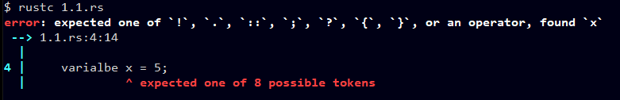
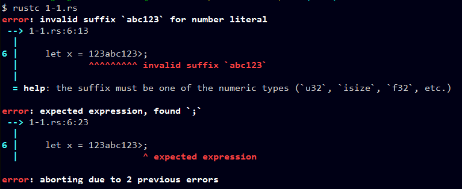
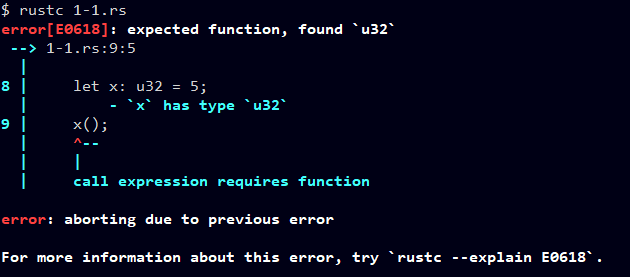
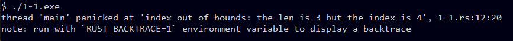

# Chapter 1. Introduction

## 1.1 
 
#### Q
Errors in a computer program can be classified according to when they are
detected and, if they are detected at compile time, what part of the compiler
detects them. Using your favorite imperative language, give an example of
each of the following.


#### A

1. A lexical error, detected by the scanner



2. A syntax error, detected by the parser



3. A static semantic error, detected by semantic analysis



4. A dynamic semantic error, detected by code generated by the compiler



5. An error that the compiler can neither catch nor easily generate code to
catch (this should be a violation of the language definition, not just a
program bug)

I can't find this... in Rust.

```rust
fn main() {

    // 1. 
    varialbe x = 5;

    // 2.
    let x = 123abc123>;

    // 3.
    let x: u32 = 5;
    x();

    // 4.
    let v = vec![1, 2, 3];
    println!("{}", v[4]);

    // 5.
    // I don't know..
}
```

---

## 1.2 

#### Q

Consider again the Pascal tool set distributed by Niklaus Wirth (Example 1.15). After successfully building a machine language version of the
Pascal compiler, one could in principle discard the P-code interpreter and
the P-code version of the compiler. Why might one choose not to do so?

#### A

If one wants to add or update some features of Pascal, if he/she wants to do that with P-code/Pascal code(not machine code), this needs P-code interpreter and P-code version of the compiler.


--- 

## 1.3 

#### Q

Imperative languages like Fortran and C are typically compiled, while
scripting languages, in which many issues cannot be settled until run time,
are typically interpreted. Is interpretation simply what one “has to do” when
compilation is infeasible, or are there actually some advantages to interpreting a language, even when a compiler is available?

#### A

Interpretation can gain greater flexibility and better diagnostics.
Also, some abilities, for example, to write a new piece of language itself and execute is only for interpretation.
So interpretation implementation can be a choice.


---

## 1.4

#### Q

```C 
// example 1.20.
int main() {
    int i = getint(), j = getint();
    while (i != j) {
        if (i > j) i = i - j;
        else j = j - i;
    }
    putint(i);
}
```

The gcd program of Example 1.20 might also be written
```C
// new program.
int main() {
    int i = getint(), j = getint();
    while (i != j) {
        if (i > j) i = i % j;
        else j = j % i;
    }
    putint(i);
}
```
Does this program compute the same result? If not, can you fix it? Under
what circumstances would you expect one or the other to be faster?


#### A

Same Result? -> NO. 
New program using `%` can throw "divide by zero" error.
So it must be fixed with zero checking.
This can be fixed like below codes.

Under All circumstances, second one(using `%`) would be faster.

```C
#include <stdio.h>

int main()
{
    int i, j;

    scanf("%d %d", &i, &j);
    while (1)
    {
        if (i == j)
        {
            printf("%d\n", i);
            break;
        }
        if (i > j)
            i = i - j;
        else
            j = j - i;
    }

    scanf("%d %d", &i, &j);
    while (1)
    {
        if (!i || !j) // if either one is zero, gcd is just 1;
        {
            printf("1\n");
            break;
        }
        if (i == j)
        {
            printf("%d\n", i);
            break;
        }
        if (i > j)
            i = i % j;
        else
            j = j % i;
    }

    return 0;
}
```

---

## 1.5 

#### Q

Expanding on Example 1.25, trace an interpretation of the gcd program on
the inputs 12 and 8. Which syntax tree nodes are visited, in which order?


#### A

1. `:=` `i` `call` `getint(12)`

2. `:=` `j` `call` `getint(8)`

3. `while` `!=` `12` `8`

4. `if` `>` `12` `8`

5. `:=` `i` `-` `12` `8`

6. `while` `!=` `4` `8`

7. `if` `>` `4` `8`

8. `:=` `j` `-` `8` `4`

9. `!=` `4` `4`

10. `call` `putint()` `4`

Above traversal orders is somewhat like prefix notation.

In 1, 2, 5, 8 lines, `i` and `j` are used by L-value: so i wrote those by its name.

But, at other lines, they used by R-value: so i wrote those by its value


---


## 1.6 

#### Q

Both interpretation and code generation can be performed by traversal of a
syntax tree. Compare these two kinds of traversals. In what ways are they
similar/different?

#### A

1. **Similar**
    + Both of those traverse syntax tree with their same semantic orders.
2. **Different**
    + interpretation: when traversing, it execute corresponding functionality also.
    + code generation: when traversing, it makes intermediate code(assembly) corresponding functionality.
        - ex. assign symbol to store mem, value using to load mem, making branch, using proper arithmetic instruction... etc.

---

## 1.7


#### Q

In your local implementation of C, what is the limit on the size of integers? What happens in the event of arithmetic overflow? What are the
implications of size limits on the portability of programs from one machine/compiler to another? How do the answers to these questions differ
for Java? For Ada? For Pascal? For Scheme? (You may need to find a manual.)


#### A

```C
#include <stdio.h>
#include <limits.h>

int main() {
    int i;
    printf("limit on the size of integers: %d\n", INT_MAX);

    i = INT_MAX + 1;
    printf("arithmetic overflow <- INT_MAX + 1 : %d\n", i);
}
```

```C
// output
limit on the size of integers: 2147483647
arithmetic overflow <- INT_MAX + 1 : -2147483648
```

In `gcc -Wno-overflow 1-7.c` compile option.

I can't test right now in Java, Ada, Pascal, Scheme.. maybe later.

---

## 1.8

#### Q

The Unix `make` utility allows the programmer to specify dependences among
the separately compiled pieces of a program. If file `A` depends on file `B` and
file `B` is modified, `make` deduces that `A` must be recompiled, in case any of
the changes to `B` would affect the code produced for `A`. How accurate is this
sort of dependence management? Under what circumstances will it lead
to unnecessary work? Under what circumstances will it fail to recompile
something that needs to be recompiled?

#### A

1. In my thought.. `make` use some of `mtime` status of the `B` file, and if it is modified, `make` recompile the dependence `A`.
2. `mtime` is modified when just saved or unnecessary space or new line is added. At this case, `B` file's functionality is never changed, but `A` would be unnecessarily recompiled.
3. If `B` is modified, and it has somewhat unsafe codes or wrong syntaxes, `A` would fail to recompile, because of dependency to not working `B`.

---

## 1.9

Why is it difficult to tell whether a program is correct? How do you go about
finding bugs in your code? What kinds of bugs are revealed by testing? What
kinds of bugs are not? (For more formal notions of program correctness,
see the bibliographic notes at the end of Chapter 4.)


